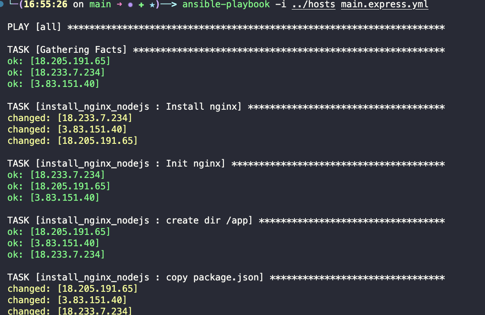

# ansible
Created: 2022-12-02 06:07

## Setup
### Install
 - From docs [1], you need python3 and pip, after that, run:
```sh
python3 -m pip install --user ansible
```
 - Command completion:
```sh
python3 -m pip install --user argcomplete
```
 - Alternatively, if that not work, you can clone project and build it, or use ```
export PATH=$PATH:/path/to/ansible``` in the bash or install with root:
```sh
sudo pip3 install ansible
sudo pip3 install ansible --upgrade
```
 - Test Ansible using a ping to localhost:
```sh
echo 'localhost ansible_connection=local' >> hosts
cd /root/ansible/
ansible -i hosts all -m ping 
```
### Docker Setup
 - Configure [docker files](https://github.com/vinicamposdev/devops-study/tree/main/ansible/docker)
 - Connect throw docker
```sh
docker-compose up -d
docker exec -it control bash
ssh-keygen
cd /root/.ssh/
ssh-copy-id root@node1
```
### If Docker SSH fails
 - Log in the instances
```sh
docker exec -it node1 bash
service ssh start
```
 - Try again
 - If there some fail, [3] just alter the ansible config:
```sh
vi /etc/ansible/ansible.cfg 
```
 - Add following:
```cfg
[ssh_connection]
control_path_dir=/dev/shm/ansible_control_path
```
 - Check status of ssh service[4]:
```sh
service ssh status
service ssh start
iptables -A INPUT -p tcp --dport ssh -j ACCEPT
vi /etc/ssh/sshd_config         
 /etc/init.d/ssh restart.
```
### Connect Others Containers
 - Run con controll container:
```sh
ssh root@node1
```
 - ensure that have the authorized keys (must have root@control):
```sh
cat /root/.ssh/authorized_keys 
```
 - go back to control
```sh
logout
```
 - apply ansible
```sh
cd /root/ansible/
echo 'node1' >> hosts
ansible -i hosts all -m ping
```
 - must ping with success the node1

## Commands
 - know what happens in the machine
```sh
ansible -i hosts node1 -m setup
```
 - AdHocs 
	 - execute only once
	 - ping is an example
	 - know the hosts
	 - ansible -i hosts \<HOSTNAME or all\> -m \<COMMAND\> -a \<ARGUMENTS\>
		 - ARGUMENTS
			 - update_cache: yes or no
			 - name: command (e.g.  apt, git)
			 - state
				 - absent: remove if exists
				 - present: add if not exists
			 - examples:
```sh
ansible -i hosts all -m apt -a "update_cache=yes name=git state=present"
ansible -i hosts all -m git -a "repo=https://github.com/vinicamposdev/devops-study dest=/root/devops-study"
ansible -i hosts all -m apt -a 
 "update_cache=yes name=nginx state=present"
```
## Playbooks
	 - set of commands
	 - imperative
 - set nginx in ansible
```yml
---
- hosts: all
  remote_user: ubuntu
  become: yes

  tasks:
    - name: Install nginx
      apt:
        name: nginx
        state: present
        update_cache: yes

    - name: Init nginx
      service:
        name: nginx
        state: started
```
 - set hosts on the same directory of playbook
 - execute the playbook
```sh
ansible-playbook -i hosts playbook.yml 
```
 - you can change the state to
	 - started: just start
	 - restarted: kill and start again
	 - reloaded: not end service, just update it
 - you can do a lot of [apt commands](https://docs.ansible.com/ansible/latest/collections/ansible/builtin/apt_module.html) like:
	 - install list of packages
	 - upgrade packages, os
	 - [docker](https://docs.ansible.com/ansible/latest/scenario_guides/guide_docker.html), [kubernetes](https://docs.ansible.com/ansible/latest/collections/kubernetes/core/k8s_module.html)
	 - run cloud providers like [aws](https://docs.ansible.com/ansible/latest/collections/amazon/aws/index.html)
## Ansible Galaxy
 - create directories
 - help organize playbooks
 - work with roles
	 - tasks
	 - configurations
	 - steps to execution/installation

```sh
ansible-galaxy init install_nginx
```
 - galaxy will create the following file structure
	 - tasks
		 - execute commands like apt, node, python, etc
	 - handlers
		 - reuse code (DRY)
	 - vars
		 - create variables to use in templates
	 - templates
		 - can create files using variables from vars
 - create a main.yml in the same level of install_nginx
```yml
- hosts: all
  remote_user: ubuntu
  become: yes
  roles:
    - install_nginx
```
 - then execute this roles with the playbook
```
ansible-playbook -i ../hosts main.yml 
```
 - that will result in the following output


## References
1. [Installation](https://docs.ansible.com/ansible/latest/installation_guide/intro_installation.html)
2. [FullCycle](https://plataforma.fullcycle.com.br/courses/184/168/131/conteudos?capitulo=131&conteudo=7331)